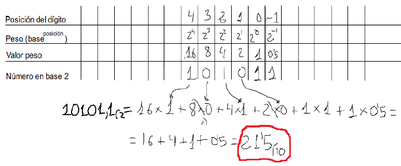
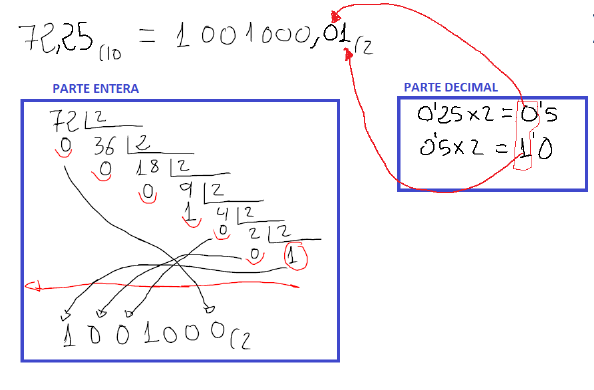
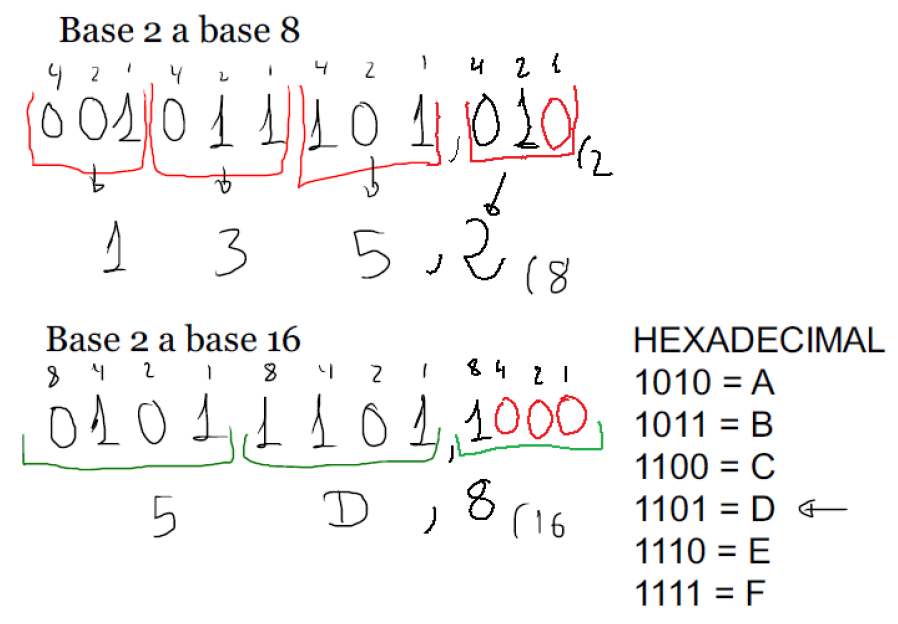
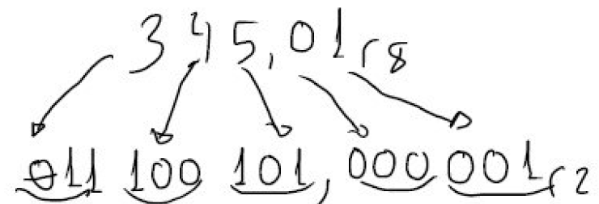
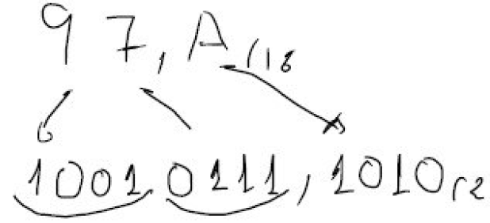
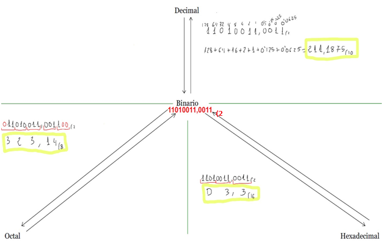

# Unidad de trabajo 1. Introducción a la informática y representación de la información

## 1. La informática

<u>La **informática** es la ciencia y la tecnología que se encarga del tratamiento automático de la información mediante el uso de ordenadores y otros dispositivos electrónicos.</u> Su objetivo es facilitar el almacenamiento, procesamiento, transmisión y recuperación de la información de forma rápida, segura y eficiente.

El término **informática** procede de la unión de las palabras **información** y **automática**, haciendo referencia al tratamiento automático de los datos. Gracias a la informática es posible realizar tareas que, de forma manual, resultarían mucho más lentas, costosas o incluso imposibles debido al enorme volumen de información que deben procesar.

En la actualidad, la informática está presente prácticamente en todos los ámbitos de la sociedad. Se utiliza en la educación, la medicina, la industria, el comercio, la banca, las comunicaciones, la investigación científica, el ocio y en la administración pública, entre muchos otros sectores. Cada vez que utilizamos un teléfono móvil, realizamos una compra por Internet, consultamos el saldo de nuestra cuenta bancaria o enviamos un correo electrónico, estamos haciendo uso de sistemas informáticos.

Además de los ordenadores personales, la informática también está presente en multitud de dispositivos cotidianos como televisores inteligentes, consolas de videojuegos, relojes inteligentes, vehículos, electrodomésticos o sistemas de control industrial. Todos ellos incorporan componentes electrónicos y programas informáticos que permiten automatizar determinadas funciones.

La informática combina conocimientos procedentes de distintas disciplinas, como la electrónica, las matemáticas, las telecomunicaciones y la programación, con el objetivo de desarrollar sistemas capaces de gestionar información de manera eficiente.

### 1.1 ¿Qué es un sistema informático?

<u>Un **sistema informático** es el conjunto formado por un ordenador y el usuario que lo utiliza para realizar una determinada tarea</u>.

Aunque muchas personas identifican un sistema informático únicamente con un ordenador, en realidad se trata de un concepto mucho más amplio. Un ordenador por sí solo no puede realizar ninguna tarea útil si no dispone del software adecuado ni de una persona que lo utilice correctamente.

Todo sistema informático está formado por tres elementos esenciales:

- **Hardware**, que corresponde a todos los componentes físicos del sistema.
- **Software**, formado por los programas e instrucciones que controlan el funcionamiento del hardware.
- **Usuarios**, que utilizan el sistema para realizar diferentes tareas y obtener información.

En muchos casos también se consideran parte del sistema informático los **datos**, que constituyen la información que será procesada, y los **procedimientos**, que describen la forma correcta de utilizar el sistema.

El funcionamiento de un sistema informático puede resumirse en cuatro fases:

1. **Entrada de datos.** El usuario o un dispositivo introduce información en el sistema.
2. **Procesamiento.** El hardware, controlado por el software, realiza las operaciones necesarias sobre los datos.
3. **Almacenamiento.** La información puede guardarse para utilizarla posteriormente.
4. **Salida de información.** El sistema presenta los resultados al usuario mediante una pantalla, una impresora, un altavoz u otro dispositivo de salida.

Por ejemplo, cuando escribimos un documento en un procesador de textos, utilizamos el teclado para introducir la información, el procesador ejecuta las operaciones necesarias, el documento se guarda en el disco duro y posteriormente puede mostrarse en pantalla o imprimirse.

### 1.2 Tipos de sistemas informáticos

Los sistemas informáticos pueden clasificarse atendiendo a diferentes criterios, como su tamaño, su capacidad de procesamiento, el número de usuarios a los que dan servicio o el entorno en el que se utilizan. Sin embargo, una de las clasificaciones más utilizadas consiste en diferenciarlos según la función que desempeñan dentro de una organización o de la sociedad.

A continuación se describen algunos de los tipos de sistemas informáticos más habituales.

#### Ordenadores personales

Los **ordenadores personales**, también conocidos como **PC (Personal Computer)**, son sistemas informáticos diseñados para ser utilizados por un único usuario de forma habitual.

Se emplean para realizar tareas de ofimática, navegación por Internet, programación, diseño gráfico, edición multimedia, videojuegos y muchas otras actividades cotidianas.

Dentro de esta categoría se incluyen tanto los ordenadores de sobremesa como los ordenadores portátiles.

#### Servidores

Un **servidor** es un sistema informático diseñado para proporcionar servicios y recursos a otros equipos conectados a una red.

Entre los servicios que puede ofrecer un servidor se encuentran el almacenamiento de archivos, la impresión compartida, el alojamiento de páginas web, la gestión de bases de datos, el correo electrónico o la autenticación de usuarios.

Los servidores suelen disponer de mayor capacidad de procesamiento, memoria y almacenamiento que un ordenador personal, ya que deben atender simultáneamente las peticiones de numerosos usuarios.

#### Dispositivos móviles

Los **dispositivos móviles** son sistemas informáticos de pequeño tamaño diseñados para ser transportados y utilizados en cualquier lugar.

Los teléfonos inteligentes (*smartphones*) y las tabletas son los ejemplos más representativos de este tipo de sistemas. Incorporan procesadores, memoria, almacenamiento, sensores, cámaras y sistemas de comunicación inalámbrica, permitiendo ejecutar aplicaciones muy similares a las de un ordenador personal.

#### Sistemas embebidos

Un **sistema embebido** es un sistema informático integrado en otro dispositivo cuya función es controlar su funcionamiento.

A diferencia de un ordenador personal, estos sistemas están diseñados para realizar una tarea concreta y específica.

Podemos encontrar sistemas embebidos en automóviles, electrodomésticos, televisores inteligentes, impresoras, ascensores, robots industriales o dispositivos médicos.

En muchos casos funcionan de manera completamente transparente para el usuario, que ni siquiera es consciente de su existencia.

#### Superordenadores

Los **superordenadores** son sistemas informáticos con una enorme capacidad de cálculo, diseñados para resolver problemas extremadamente complejos que requieren una gran potencia de procesamiento.

Se utilizan en áreas como la investigación científica, la predicción meteorológica, la simulación de fenómenos físicos, el desarrollo de nuevos medicamentos, la inteligencia artificial o la exploración espacial.

Su potencia se consigue mediante la utilización de miles de procesadores que trabajan de forma coordinada.

#### Sistemas informáticos industriales

Los **sistemas informáticos industriales** están diseñados para controlar y supervisar procesos de fabricación y producción.

Se emplean en fábricas, centrales eléctricas, plantas químicas o infraestructuras críticas, donde deben garantizar un funcionamiento continuo, fiable y seguro.

En este tipo de sistemas es habitual utilizar controladores industriales, sensores y sistemas operativos de tiempo real para responder de forma inmediata ante cualquier incidencia.

### 1.3 Importancia de los sistemas informáticos

Los sistemas informáticos constituyen la base del funcionamiento de la sociedad actual. Empresas, hospitales, bancos, administraciones públicas, universidades y prácticamente cualquier organización dependen de ellos para desarrollar su actividad diaria.

Su utilización permite automatizar procesos, reducir errores, almacenar grandes cantidades de información, mejorar la comunicación y aumentar considerablemente la productividad.

Por este motivo, conocer cómo funcionan los sistemas informáticos y cuáles son sus componentes resulta fundamental para cualquier profesional del ámbito de la informática, ya que todos los módulos del ciclo formativo se apoyan, de una u otra forma, en estos conceptos básicos.

## 2. Elementos de un sistema informático

Como se ha explicado en el apartado anterior, todo sistema informático está formado por tres elementos esenciales: **hardware**, **software** y **usuario**. Estos tres elementos trabajan de forma coordinada para permitir el tratamiento automático de la información.

El hardware proporciona los recursos físicos necesarios para que el sistema pueda funcionar. El software indica al hardware qué operaciones debe realizar y cómo debe realizarlas. Por último, el usuario es quien interactúa con el sistema informático para realizar una determinada tarea y obtener los resultados deseados.

La ausencia de cualquiera de estos tres elementos impediría el correcto funcionamiento del sistema informático. Por ejemplo, un ordenador sin software no podría ejecutar ninguna tarea, mientras que un sistema completamente configurado carecería de utilidad si no existiera un usuario que interactuase con él.

### 2.1 Hardware

<u>El **hardware** es el conjunto de todos los componentes físicos que forman parte de un sistema informático y que pueden verse y tocarse.</u>

El hardware constituye la parte material del sistema informático. Está formado por todos los dispositivos electrónicos, eléctricos y mecánicos que permiten introducir datos, procesarlos, almacenarlos y mostrar los resultados obtenidos.

Todos los equipos informáticos, independientemente de su tamaño o finalidad, disponen de hardware. Desde un teléfono móvil hasta un superordenador, todos ellos incorporan componentes físicos que hacen posible su funcionamiento.

Algunos **ejemplos de hardware** son: placa base, memoria RAM, monitor, teclado, impresora, altavoces, etc.

Aunque el hardware proporciona la capacidad física para realizar operaciones, por sí solo es incapaz de ejecutar ninguna tarea. Para ello necesita el software, que contiene las instrucciones necesarias para controlar su funcionamiento.

### 2.2 Software

<u>El **software** es el conjunto de programas, instrucciones y datos que permiten controlar el funcionamiento del hardware y realizar diferentes tareas.</u>

A diferencia del hardware, el software no posee una forma física y, por tanto, no puede tocarse. Se almacena en dispositivos de almacenamiento como discos duros, unidades SSD o memorias USB y se carga en la memoria principal cuando va a ejecutarse.

El software es el encargado de indicar al hardware qué operaciones debe realizar. Gracias a él es posible utilizar un ordenador para escribir documentos, navegar por Internet, reproducir contenido multimedia, programar aplicaciones o jugar a videojuegos.

Existen diferentes formas de clasificar el software. Una de las más utilizadas consiste en distinguir tres grandes grupos: **software de sistema**, **software de aplicación** y **software de programación**.

#### Software de sistema

El **software de sistema** está formado por el conjunto de programas encargados de gestionar y controlar el funcionamiento del ordenador.

Su misión es administrar los recursos hardware y proporcionar el entorno necesario para que el resto de programas puedan ejecutarse correctamente.

El ejemplo más importante de software de sistema es el **sistema operativo**, aunque también forman parte de este grupo los controladores de dispositivos (*drivers*) y diversas utilidades del sistema.

Algunos ejemplos de sistemas operativos son Microsoft Windows, GNU/Linux, macOS o Android.

#### Software de aplicación

El **software de aplicación** está formado por los programas que utiliza el usuario para realizar tareas concretas.

Estos programas se ejecutan sobre el sistema operativo y permiten desarrollar actividades muy diversas, como redactar documentos, navegar por Internet, editar imágenes, reproducir música o gestionar bases de datos.

Algunos ejemplos de software de aplicación son: Microsoft Word, Google Chrome, Adobe Photoshop, VLC Media Player, etc.

#### Software de programación

El **software de programación** está formado por las herramientas que utilizan los programadores para desarrollar nuevas aplicaciones informáticas.

Este tipo de software permite escribir, editar, compilar, depurar y probar programas desarrollados en distintos lenguajes de programación.

Algunos ejemplos son: Visual Studio Code, Eclipse, NetBeans, Arduino IDE, etc.

## 2.3 Usuario

<u>El **usuario** es la persona que utiliza el sistema informático para realizar una determinada tarea mediante la interacción con el hardware y el software.</u>

El usuario constituye uno de los elementos esenciales del sistema informático, ya que es quien introduce los datos, ejecuta los programas y utiliza la información obtenida para alcanzar un determinado objetivo.

Dependiendo del entorno en el que se utilice el sistema informático, un mismo equipo puede ser utilizado por uno o varios usuarios. En un ordenador personal normalmente existe un único usuario principal, mientras que en un servidor pueden trabajar simultáneamente decenas o incluso miles de usuarios.

Los usuarios pueden poseer diferentes niveles de responsabilidad dentro del sistema. Algunos únicamente utilizan las aplicaciones disponibles para realizar su trabajo, mientras que otros, como los administradores del sistema, disponen de permisos especiales para instalar programas, modificar la configuración del sistema operativo o administrar los recursos del equipo.

La correcta interacción entre el hardware, el software y el usuario permite que el sistema informático funcione de manera eficiente y satisfaga las necesidades para las que ha sido diseñado.

## 3. El ordenador

El **ordenador** es una máquina electrónica programable capaz de recibir datos, procesarlos automáticamente y generar información útil. Para ello utiliza tanto componentes físicos como componentes lógicos que trabajan de forma coordinada.

Aunque existen ordenadores de muy diferentes tamaños y capacidades, todos ellos comparten una estructura básica formada por componentes físicos, encargados de realizar las operaciones materiales, y componentes lógicos, responsables de controlar el funcionamiento del sistema y permitir la ejecución de programas.

### 3.1 Componentes físicos

Los **componentes físicos**, también conocidos como **hardware**, son todos aquellos elementos materiales que forman parte del ordenador y que pueden verse y tocarse.

Cada uno de estos componentes desempeña una función específica dentro del sistema informático. Algunos se encargan de procesar la información, otros de almacenarla y otros permiten la comunicación entre el usuario y el ordenador.

Los principales componentes físicos de un ordenador son el procesador, la memoria principal, los dispositivos de almacenamiento, la placa base y los periféricos.

#### Procesador (CPU)

<u>La **CPU** (*Central Processing Unit*), también conocida como **procesador**, es el componente encargado de interpretar y ejecutar las instrucciones de los programas, además de realizar los cálculos y operaciones necesarios para el funcionamiento del ordenador.</u>

La CPU coordina la ejecución de los programas procesando continuamente las instrucciones y los datos que recibe. Para ello realiza millones de operaciones por segundo y trabaja conjuntamente con la memoria RAM y el resto de componentes del sistema.

Su rendimiento depende de diversos factores, como la velocidad de funcionamiento, el número de núcleos, la memoria caché o la arquitectura utilizada.

Actualmente, los principales fabricantes de procesadores para ordenadores personales son Intel y AMD.

#### Memoria RAM

<u>La **memoria RAM** (*Random Access Memory*) es la memoria principal del ordenador y se utiliza para almacenar temporalmente los programas y datos que están siendo utilizados en un determinado momento.</u>

La memoria RAM es una memoria volátil, lo que significa que su contenido se pierde cuando el ordenador se apaga o deja de recibir alimentación eléctrica.

Cuanta mayor cantidad de memoria RAM tenga un equipo, mayor será su capacidad para ejecutar varios programas simultáneamente y trabajar con aplicaciones que requieren una gran cantidad de memoria.

#### Dispositivos de almacenamiento

<u>Los **dispositivos de almacenamiento** permiten guardar de forma permanente los programas, los documentos y el resto de información del sistema informático.</u>

A diferencia de la memoria RAM, la información almacenada en estos dispositivos no se pierde al apagar el ordenador.

En la actualidad, los dispositivos más utilizados son los discos duros (**HDD**) y las unidades de estado sólido (**SSD**). Los SSD ofrecen una mayor velocidad de lectura y escritura, un menor consumo energético y una mayor resistencia frente a golpes, mientras que los discos duros tradicionales suelen ofrecer una mayor capacidad de almacenamiento a un menor coste.

#### Placa base

<u>La **placa base**, también denominada **placa madre** o **motherboard**, es el circuito principal del ordenador sobre el que se conectan y comunican todos los componentes del sistema.</u>

La placa base integra los conectores, circuitos y buses necesarios para permitir la comunicación entre el procesador, la memoria RAM, los dispositivos de almacenamiento, las tarjetas de expansión y el resto de elementos del ordenador.

La elección de una placa base determina aspectos importantes como el tipo de procesador compatible, la cantidad máxima de memoria RAM o el número de dispositivos que pueden conectarse al equipo.

#### Periféricos

<u>Los **periféricos** son dispositivos que permiten al ordenador comunicarse con el exterior, ya sea para introducir información, mostrar resultados o almacenar datos.</u>

Dependiendo de la función que desempeñen, los periféricos pueden clasificarse en:

- **Periféricos de entrada**, como el teclado, el ratón, el escáner o el micrófono.
- **Periféricos de salida**, como el monitor, la impresora o los altavoces.
- **Periféricos de entrada y salida**, como las pantallas táctiles o determinadas impresoras multifunción.
- **Periféricos de almacenamiento**, como los discos duros externos, las memorias USB o las tarjetas de memoria.

Los periféricos permiten adaptar el ordenador a las necesidades de cada usuario y ampliar sus posibilidades de utilización.

### 3.2 Componentes lógicos

Los **componentes lógicos**, también conocidos como **software**, son el conjunto de programas que permiten controlar el funcionamiento del ordenador y utilizar sus recursos para realizar diferentes tareas.

Sin software, el hardware sería incapaz de realizar ninguna operación útil, ya que necesita recibir instrucciones que indiquen qué debe hacer y cómo debe hacerlo.

Los principales componentes lógicos de un ordenador son el sistema operativo, los controladores y las aplicaciones.

#### Sistema operativo

<u>El **sistema operativo** es el software fundamental del ordenador, encargado de gestionar los recursos hardware y proporcionar el entorno necesario para que puedan ejecutarse el resto de programas.</u>

Entre sus principales funciones se encuentran administrar la memoria, gestionar los dispositivos de almacenamiento, controlar los periféricos, organizar los archivos y permitir la comunicación entre el hardware y las aplicaciones.

Algunos de los sistemas operativos más utilizados son Microsoft Windows, GNU/Linux, macOS, Android e iOS.

El funcionamiento y las características de los sistemas operativos se estudiarán con mayor profundidad en las siguientes unidades del módulo.

#### Controladores

<u>Los **controladores**, también conocidos como **drivers**, son programas que permiten al sistema operativo comunicarse correctamente con los diferentes dispositivos hardware del ordenador.</u>

Cada dispositivo necesita un controlador específico para que el sistema operativo conozca sus características y pueda utilizar todas sus funciones.

Sin el controlador adecuado, un dispositivo puede funcionar de forma limitada o incluso dejar de ser reconocido por el sistema operativo.

#### Aplicaciones

<u>Las **aplicaciones** son programas diseñados para que el usuario pueda realizar tareas concretas utilizando los recursos del ordenador.</u>

Existen aplicaciones para prácticamente cualquier actividad, como redactar documentos, navegar por Internet, editar fotografías, reproducir contenido multimedia, programar aplicaciones o gestionar bases de datos.

Todas las aplicaciones necesitan un sistema operativo para poder ejecutarse, ya que es este quien proporciona los servicios necesarios para acceder al hardware del ordenador.

En conjunto, los componentes físicos y los componentes lógicos permiten que el ordenador funcione correctamente y pueda satisfacer las necesidades de sus usuarios. Mientras que el hardware proporciona los recursos materiales, el software controla su funcionamiento y ofrece las herramientas necesarias para realizar cualquier tipo de tarea.

## 4. Licencias de software

El **software** está protegido por la legislación sobre propiedad intelectual, por lo que no puede utilizarse, copiarse, modificarse o distribuirse libremente sin respetar las condiciones establecidas por su autor o por la empresa que posee sus derechos.

Estas condiciones reciben el nombre de **licencia de software**.

<u>Una **licencia de software** es un acuerdo entre el propietario de un programa y el usuario que establece los derechos y las limitaciones de uso del software.</u>

Es importante no confundir conceptos como **software libre**, **código abierto** o **freeware**, ya que hacen referencia a aspectos diferentes. Mientras unos se centran en los derechos que tiene el usuario sobre el programa, otros hacen referencia al acceso al código fuente o simplemente a la forma en que se distribuye el software.

A continuación se describen los principales tipos de licencias.

### 4.1 Software propietario

<u>El **software propietario** es aquel cuyo uso, copia, modificación y distribución están limitados por la licencia establecida por su propietario.</u>

En este tipo de software, el propietario conserva el control sobre el programa y establece las condiciones bajo las que puede utilizarse. Normalmente, el código fuente no está disponible para los usuarios, por lo que no pueden estudiarlo, modificarlo ni redistribuirlo libremente.

**El software propietario puede ser de pago o gratuito**, ya que su clasificación no depende del precio, sino de las condiciones establecidas por su licencia.

Algunos ejemplos son: Microsoft Windows, Microsoft Office o Adobe Photoshop, Google Chrome o Microsoft Edge.

### 4.2 Software libre

<u>El **software libre** es aquel cuya licencia garantiza a los usuarios las libertades de usar, estudiar, modificar y distribuir el programa.</u>

El software libre se caracteriza por conceder a los usuarios una serie de libertades sobre el programa. Estas libertades permiten utilizarlo con cualquier finalidad, estudiar su funcionamiento, modificarlo y distribuir tanto el programa original como las versiones modificadas.

Para que un usuario pueda estudiar o modificar un programa es necesario disponer de su **código fuente**, por lo que este debe estar accesible.

Las cuatro libertades fundamentales del software libre son:

- Utilizar el programa con cualquier finalidad.
- Estudiar cómo funciona y adaptarlo a las propias necesidades.
- Redistribuir copias.
- Modificar el programa y distribuir las versiones modificadas.

Algunos ejemplos son: GNU/Linux, LibreOffice, GIMP y Mozilla Firefox.

### 4.3 Código abierto

<u>El **software de código abierto** (*Open Source*) es aquel cuyo código fuente está disponible para que pueda estudiarse, modificarse y distribuirse de acuerdo con los términos de su licencia.</u>

**Como mínimo, el software de código abierto garantiza que el código fuente del programa está disponible para los usuarios.** Esto permite conocer su funcionamiento interno y, en función de la licencia utilizada, modificarlo y redistribuirlo.

La principal diferencia entre el **software libre** y el **código abierto** es que el **software libre** garantiza las cuatro libertades del usuario, mientras que el software de **código abierto** puede imponer algunas condiciones sobre el uso, la modificación o la distribución del programa, aunque permita acceder a su código fuente.

En la práctica, la mayoría de los programas de código abierto también son software libre, por lo que ambos conceptos suelen coincidir. Sin embargo, no significan exactamente lo mismo.

Por este motivo, no es correcto utilizar ambos términos como si fueran sinónimos absolutos, aunque en muchos programas coincidan.

### 4.4 Freeware

<u>El **freeware** es un programa que puede utilizarse gratuitamente, pero cuyos derechos de copia, modificación y distribución siguen estando limitados por su licencia.</u>

El hecho de que un programa sea gratuito **no significa** que sea software libre ni que su código fuente esté disponible.

Muchos programas freeware permiten utilizar todas sus funciones sin coste, pero el usuario no puede modificarlos ni redistribuirlos libremente.

Algunos ejemplos de programas freeware son: Adobe Acrobat Reader, Google Chrome y Skype.

### 4.5 Shareware

<u>El **shareware** es un programa que se distribuye para su evaluación durante un tiempo limitado o con determinadas funciones restringidas.</u>

Su objetivo es que el usuario pueda probar el programa antes de adquirir la licencia completa.

Una vez finalizado el periodo de prueba o si se desea acceder a todas las funciones, normalmente es necesario comprar la licencia.

Son habituales distintas modalidades de shareware, como:

- Programas con límite de tiempo.
- Programas con funciones deshabilitadas.
- Programas que muestran recordatorios para adquirir la versión completa.

### 4.6 Software de dominio público

<u>El **software de dominio público** es aquel que no está protegido por derechos de autor o cuyos derechos han sido cedidos expresamente a la sociedad.</u>

Esto permite que cualquier persona pueda utilizarlo, copiarlo, modificarlo y distribuirlo sin necesidad de solicitar autorización.

Aunque es poco frecuente, conviene no confundir el software de dominio público con el software libre. Ambos permiten un uso muy amplio del programa, pero el software libre sigue estando protegido por una licencia que garantiza determinadas libertades, mientras que el software de dominio público carece de esas restricciones derivadas de los derechos de autor.

### Resumen

Es habitual confundir algunos de estos conceptos. Para evitar errores, conviene recordar las siguientes ideas:

- **Software propietario**: el uso está limitado por la licencia y el código fuente normalmente no está disponible.
- **Software libre**: garantiza las libertades de usar, estudiar, modificar y distribuir el programa.
- **Código abierto**: el código fuente está disponible y puede estudiarse o modificarse según su licencia.
- **Freeware**: es gratuito, pero no necesariamente libre.
- **Shareware**: permite probar el programa antes de adquirir la licencia completa.
- **Dominio público**: el programa puede utilizarse, copiarse y modificarse sin restricciones derivadas de los derechos de autor.

## 5. Representación de la información

Los ordenadores son capaces de trabajar con una gran variedad de información, como números, textos, imágenes, sonidos o vídeos. Aunque para las personas estos datos son muy diferentes entre sí, para un ordenador todos tienen algo en común: **se representan mediante combinaciones de ceros y unos**.

Esto es posible gracias al **sistema binario**, un sistema de numeración formado únicamente por dos valores: **0** y **1**. Los ordenadores utilizan este sistema porque sus circuitos electrónicos funcionan con dos estados bien diferenciados, como la presencia o ausencia de corriente eléctrica.

Gracias a esta representación binaria, un ordenador puede almacenar, procesar y transmitir cualquier tipo de información.

### 5.1 Sistemas de numeración

Antes de estudiar cómo representan los ordenadores la información, es necesario comprender qué es un **sistema de numeración**.

<u>Un **sistema de numeración** es un conjunto de símbolos y de reglas que permiten representar y escribir cantidades numéricas.</u>

A lo largo de la historia se han utilizado numerosos sistemas de numeración. Actualmente, el más empleado por las personas es el **sistema decimal**, aunque los ordenadores utilizan principalmente el **sistema binario**.

Los sistemas de numeración pueden clasificarse en **posicionales** y **no posicionales**, según la importancia que tenga la posición que ocupan sus símbolos.

#### Sistemas de numeración posicionales y no posicionales

<u>Un **sistema de numeración posicional** es aquel en el que el valor de cada símbolo depende tanto del propio símbolo como de la posición que ocupa dentro del número.</u>

En los sistemas posicionales, un mismo símbolo puede representar valores diferentes dependiendo de la posición en la que aparezca.

Por ejemplo, en el número **5 505**, el símbolo **5** aparece tres veces, pero no representa el mismo valor en todas ellas. El primer **5** representa cinco millares, el segundo cinco centenas y el tercero cinco unidades.

Los sistemas de numeración más utilizados en informática son **posicionales**, como el sistema decimal, el binario, el octal y el hexadecimal.

<u>Un **sistema de numeración no posicional** es aquel en el que el valor de cada símbolo es siempre el mismo, independientemente de la posición que ocupe.</u>

El ejemplo más conocido es la **numeración romana**, en la que cada símbolo mantiene su valor propio. Así, la letra **X** siempre representa el valor diez, independientemente de la posición en la que aparezca.

#### Teorema fundamental de la numeración

Los sistemas de numeración posicionales se basan en una propiedad conocida como **teorema fundamental de la numeración**.

<u>El **teorema fundamental de la numeración** establece que cualquier número perteneciente a un sistema de numeración posicional puede expresarse como la suma de cada uno de sus símbolos multiplicados por una potencia de la base del sistema.</u>

La **base** de un sistema de numeración coincide con el número de símbolos diferentes que utiliza para representar las cantidades.

Por ejemplo, el sistema decimal utiliza diez símbolos (del **0** al **9**), por lo que su base es **10**. En cambio, el sistema binario utiliza únicamente dos símbolos (**0** y **1**), por lo que su base es **2**.

Este principio constituye la base del funcionamiento de todos los sistemas de numeración posicionales y permite realizar operaciones como la conversión de números entre distintas bases, aspecto que se estudiará más adelante.

### 5.2 El sistema binario

<u>El **sistema binario** es un sistema de numeración que utiliza únicamente **dos símbolos**, el **0** y el **1**, para representar la información.</u>

Las personas utilizamos habitualmente el sistema decimal, formado por diez símbolos (del 0 al 9). Sin embargo, los ordenadores trabajan con el sistema binario porque resulta mucho más sencillo de implementar mediante circuitos electrónicos.

Toda la información que maneja un ordenador, independientemente de su naturaleza, acaba representándose mediante largas secuencias de ceros y unos.

### 5.3 El bit

<u>El **bit** (*Binary Digit*) es la unidad mínima de información que puede almacenar un ordenador y solo puede tomar dos valores: **0** o **1**.</u>

Un único bit puede representar únicamente dos estados diferentes, por lo que resulta insuficiente para almacenar información compleja. Por este motivo, los ordenadores agrupan varios bits para representar una mayor cantidad de datos.

El bit constituye la base sobre la que se construye toda la información que maneja un sistema informático.

### 5.4 El byte

<u>Un **byte** es un conjunto formado por **8 bits**.</u>

El byte es la unidad básica utilizada para medir la capacidad de almacenamiento y el tamaño de los archivos.

Al agrupar ocho bits es posible representar hasta **256 valores diferentes**, suficientes para codificar letras, números, símbolos y muchos otros tipos de información.

###### 5.5 Unidades de almacenamiento de la información

La cantidad de información que almacenan los ordenadores suele ser muy elevada. Por ello, en lugar de expresar siempre la capacidad en bytes, se utilizan unidades de mayor tamaño.

Existen dos formas de expresar estas unidades: **mediante múltiplos decimales**, basados en potencias de 10, y **mediante múltiplos binarios**, basados en potencias de 2.

#### Unidades decimales

Las unidades decimales son las definidas por el **Sistema Internacional de Unidades (SI)** y son las que utilizan habitualmente los fabricantes de discos duros, memorias USB, tarjetas de memoria y otros dispositivos de almacenamiento.

| Unidad   | Símbolo | Equivale a                     |
|:-------- |:-------:| ------------------------------:|
| Kilobyte | KB      | 10³ = 1.000 bytes              |
| Megabyte | MB      | 10⁶ = 1.000.000 bytes          |
| Gigabyte | GB      | 10⁹ = 1.000.000.000 bytes      |
| Terabyte | TB      | 10¹² = 1.000.000.000.000 bytes |

#### Unidades binarias

Como los ordenadores trabajan internamente con el sistema binario, también es habitual utilizar unidades basadas en **potencias de 2**. Para diferenciarlas de las unidades decimales se emplean los prefijos definidos por la **Comisión Electrotécnica Internacional (IEC)**.

| Unidad   | Símbolo | Equivale a                    |
|:-------- |:-------:| -----------------------------:|
| Kibibyte | KiB     | 2¹⁰ = 1.024 bytes             |
| Mebibyte | MiB     | 2²⁰ = 1.048.576 bytes         |
| Gibibyte | GiB     | 2³⁰ = 1.073.741.824 bytes     |
| Tebibyte | TiB     | 2⁴⁰ = 1.099.511.627.776 bytes |

En la práctica, los fabricantes de dispositivos de almacenamiento suelen indicar la capacidad utilizando las **unidades decimales** (KB, MB, GB y TB), mientras que muchos sistemas operativos calculan la capacidad utilizando **unidades binarias** (KiB, MiB, GiB y TiB). Esta diferencia explica que, en ocasiones, un disco duro o una memoria USB parezcan tener menos capacidad de la indicada por el fabricante.

Por ejemplo, un disco anunciado con una capacidad de **500 GB** contiene realmente **500.000.000.000 bytes**. Sin embargo, si esa cantidad se expresa en **GiB**, el sistema operativo mostrará aproximadamente **466 GiB**, lo que puede dar la impresión de que falta espacio, aunque en realidad ambas cifras representan la misma capacidad utilizando unidades diferentes.

### 5.6 Representación de los distintos tipos de información

Aunque para las personas un texto, una imagen o una canción son completamente diferentes, para un ordenador todos ellos se representan mediante combinaciones de bits.

Los **números** se almacenan utilizando diferentes sistemas de codificación numérica.

Los **caracteres**, como las letras, los números y los símbolos, se representan mediante códigos de caracteres, como **ASCII** o **Unicode**, que asignan un valor numérico a cada uno de ellos.

Las **imágenes digitales** están formadas por miles o millones de pequeños puntos denominados **píxeles**. Cada píxel almacena la información correspondiente a su color mediante una determinada cantidad de bits.

El **sonido digital** se obtiene transformando las ondas sonoras en una secuencia de valores numéricos que el ordenador puede almacenar y reproducir posteriormente.

Por su parte, el **vídeo digital** está formado por una sucesión de imágenes, llamadas **fotogramas**, que se muestran a gran velocidad para crear la sensación de movimiento. Habitualmente, estas imágenes van acompañadas de una o varias pistas de sonido.

En definitiva, aunque el usuario trabaje con documentos, fotografías, canciones o vídeos, el ordenador siempre almacena y procesa toda esa información mediante largas secuencias de bits. Es precisamente esta representación binaria la que permite que cualquier tipo de información pueda ser tratada por un sistema informático.

### 5.7 Conversión entre bases

A continuación se explica la forma de pasar números que están en una abse a otra base.

#### Conversión de base 2 a base 10

Para cambiar un número que está en base 2 a base 10 podemos utilizar el teorema
fundamental de la numeración. A continuación se muestra un ejemplo:

#### Conversión de base 10 a base 2

Se debe separar la parte entera de la parte decimal.

La parte entera se dividirá entre 2 hasta que obtengamos un cociente de valor 1. Para representar la parte entera del numero empezaremos poniendo el cociente (1) y a continuación los restos en orden ascendente. es decir, empezamos por el ultimo y terminamos por el primero.

La parte decimal se multiplicará por 2. Si la parte decimal de este resultado es 0, entonces finalizaremos, pero si no es 0, entonces cogeremos la parte decimal del resultado y la volveremos a multiplicar por 2. Esto se repetirá hasta que se obtenga en la parte decimal un 0 o ya tengamos varios dígitos. Para construir la parte decimal de nuestro número iremos añadiendo en orden descendente la parte entera de la multiplicación de forma que el primer número después de la coma será la parte entera de la primera operación y el último número será la parte entera de la última multiplicación. A continuación se muestra un ejemplo:

#### Conversión de base 2 a base 8 y base 16

Para convertir un número de base 2 base 8 haremos grupos de 3 bits de forma que en la parte entera comenzaremos desde la posición 1 y en la parte decimal empezaremos en la parte -1. Siempre tiene que haber 3 bits, por lo que se añadirán los 0 necesarios para que se cumpla esta condición. Cada grupo de 3 bits será convertido a base 8.

Para convertir un número de base 2 a base 16 haremos lo mismo que para convertir a base 8 solo que en lugar de hacer grupos de 3 bits, haremos grupos de 4 bits.

#### Conversión de base 8 y 16 a base 2

Para convertir un numero que esta en base 8 a base 2 se coge cada digito y se convierte a binario teniendo en cuenta que siempre seran 3 bits.

Para convertir un numero que esta en base 16 a base 2 se coge cada digito y se convierte a binario teniendo en cuenta que siempre seran 4 bits.

#### Conversión entre base 10, base 8y base 16

La forma mas sencilla de convertir numero entre base 10, base 8 y base 16 es convertir el numero a base 2 y de ahí a la base deseada.

