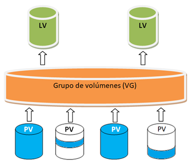

# UT3. Instalación y actualización de sistemas operativos

## 3.3. Instalación de sistemas operativos

La **instalación de un sistema operativo** consiste en copiar y configurar en el equipo los archivos necesarios para que dicho sistema pueda funcionar.

Cuando se realiza una instalación desde cero, el sistema operativo se instala sobre una partición preparada para ello y posteriormente se configuran aspectos como los usuarios, la red, las aplicaciones y el resto de parámetros necesarios.

Además de realizar una instalación nueva, en algunos casos es posible llevar a cabo una **migración**.

Una **migración** consiste en pasar de una versión del sistema operativo a otra más reciente intentando conservar, en la medida de lo posible, los datos, las cuentas de usuario, las aplicaciones instaladas y la configuración existente.

Por ejemplo, en Windows puede realizarse una migración desde una versión anterior del sistema a otra más reciente. Del mismo modo, en distribuciones GNU/Linux como Ubuntu puede actualizarse una instalación existente para pasar a una versión posterior de la misma distribución.

La migración se diferencia de una instalación desde cero en que intenta mantener la configuración y la información existente, mientras que una instalación nueva parte de un sistema recién instalado.

Antes de realizar cualquiera de estos procesos es necesario planificar adecuadamente la instalación y conocer la estructura del almacenamiento del equipo.

### 3.3.1. Particiones y esquemas de particionado

Antes de proceder a la instalación de un sistema operativo basado en Linux es necesario explicar qué es una partición, cuáles son las particiones más comunes que se crean durante la instalación y qué es el Gestor de volúmenes lógicos (LVM).

#### Particiones

Una **partición** es una división lógica de un disco duro y que permite, entre otras cosas, tener un sistema de archivos propio diferente al resto de particiones y ser formateada sin que esto afecte al resto de las particiones que haya en un disco duro.

Cada partición se comporta como un disco duro independiente. En un disco duro siempre habrá, como mínimo, una partición, pero puede haber más.

El que haya varias particiones en un disco nos permite, entre otras cosas, tener más de un sistema operativo instalado en un disco duro.

Existen dos tipos de particionado, el MBR, que es un esquema de particionado antiguo, y GPT, utilizado habitualmente en los sistemas modernos.

#### MBR (Particiones)

**MBR** viene de *Master Boot Record* y esto se debe a que la tabla de particiones que contiene la información de las particiones de un disco duro se encuentra en el primer sector del disco duro que recibe ese nombre.

En MBR existen dos tipos de particiones: primarias y extendidas. De estas puede haber hasta 4 particiones primarias o hasta 3 particiones primarias y 1 partición extendida. 

**Partición primaria:** puede contener tanto datos como un sistema operativo. Si se va a utilizar para instalar un sistema operativo, entonces esta debe ser primaria.

**Partición extendida:** va a tener unidades lógicas. Una partición extendida es, por tanto, un contenedor de unidades lógicas y en un disco solo habrá una partición extendida. Una partición extendida podrá tener hasta 23 unidades lógicas.

**Unidad lógica:** una unidad lógica se comporta como una partición (aunque no lo es) y puede utilizarse para almacenar datos y, dependiendo del sistema operativo y de la configuración de arranque, también para instalar un sistema operativo.

#### GPT

**GPT** viene de Tabla de particiones GUID y está llamado a reemplazar a MBR.

GPT utiliza otro sistema para guardar información de las particiones de un disco duro y permite crear un número mucho mayor de particiones que MBR. En implementaciones habituales, como Windows, pueden crearse hasta 128 particiones.

En el esquema GPT no existe el concepto de partición primaria y partición extendida. Todas son simplemente particiones. 

GPT es el esquema de particionado asociado a los sistemas modernos que utilizan firmware UEFI, mientras que MBR es el esquema tradicionalmente utilizado con BIOS.

Por este motivo, en los equipos actuales la configuración habitual es **UEFI + GPT**, mientras que en los equipos antiguos era **BIOS + MBR**.

Aunque existen algunas excepciones, como determinados sistemas Linux que pueden arrancar mediante BIOS desde discos GPT, estas configuraciones son menos habituales.

### 3.3.2. Instalación de un sistema operativo GNU/Linux

#### Gestor de volúmenes lógicos 

El **Gestor de Volúmenes Lógicos de Linux** o *LVM (Logical Volume Manager)* es una tecnología que permite agrupar el espacio de almacenamiento de varias particiones y/o discos.

De este modo, por ejemplo, se puede combinar el espacio de almacenamiento de varias particiones o soportes de datos dentro de un **grupo de volúmenes**.

A partir de ese espacio se pueden crear uno o varios **volúmenes lógicos (LV)**, que se comportan de forma similar a una partición.

Cada volumen lógico podrá tener su propio sistema de archivos.

Particiones/discos → **volúmenes físicos (PV)**

Varios PV → **grupo de volúmenes (VG)**

Dentro del VG → **volúmenes lógicos (LV)**

#### Particiones de Linux

Antes de proceder a la instalación se recomienda tener en cuenta si se van a crear las particiones de forma manual o si se va a dejar al asistente de instalación crear las particiones.

Si vamos a crear manualmente las particiones debemos saber que en Linux se accede a las distintas particiones a través de un directorio que se conoce como **punto de montaje** y es que en Linux, a diferencia de Windows, no existe el concepto de unidad.

Recordemos que a cada partición en Windows se le asigna una letra de unidad.

A continuación se describen las particiones más habituales que se crean durante la instalación de un sistema operativo Linux, junto con su función principal y el tamaño recomendado.

- Partición de arranque BIOS/UEFI.
- Una partición swap.
- Una partición `/boot`.
- Una partición `/`.
- Una partición `home`.

##### Partición de arranque BIOS/EFI

Entre los distintos tipos de particiones que se pueden crear durante la instalación de un sistema operativo, una de las más importantes es la partición de arranque.

Esta partición se utiliza para almacenar el cargador de arranque, el componente encargado de iniciar el sistema operativo una vez encendido el ordenador.

El tipo de partición de arranque que se crea depende del firmware del equipo:

- En los equipos antiguos que utilizan BIOS (*Basic Input/Output System*), el cargador de arranque se instala en una partición BIOS de arranque.
- En los equipos modernos que utilizan UEFI (*Unified Extensible Firmware Interface*), se emplea una partición del sistema EFI para alojar los archivos necesarios para el arranque.

**Características de cada tipo**

En los equipos con **BIOS (Legacy)**, se crea una partición BIOS de arranque, sin sistema de archivos y con un tamaño aproximado de 1 MB.

Esta partición no se monta en ningún punto del sistema y se utiliza para almacenar el código del cargador de arranque GRUB cuando el sistema trabaja en modo BIOS.

En los equipos con **UEFI**, se utiliza una partición del sistema EFI (ESP), formateada en FAT32 y con un tamaño de unos 500 MB.

Esta partición se monta en `/boot/efi` y contiene los archivos del cargador de arranque, como `grubx64.efi`, además de las claves o certificados necesarios para el arranque seguro (*Secure Boot*).

**Creación automática o manual**

Dependiendo de la distribución y de la versión del instalador, la partición de arranque puede crearse automáticamente o ser necesario definirla manualmente.

En versiones modernas, como Ubuntu 24.04, el asistente de instalación detecta automáticamente el modo de inicio del sistema (BIOS o UEFI) y crea el tipo de partición adecuado sin que el usuario tenga que especificarlo.

En versiones anteriores o instalaciones totalmente manuales, puede ser necesario crear a mano la partición correspondiente (BIOS o EFI) durante el proceso de particionado.

> [!NOTE]
>
> Nota sobre máquinas virtuales en VirtualBox
>
> En VirtualBox, al crear una máquina virtual, se puede elegir si el firmware será BIOS o UEFI:
>
> - Si no se marca la opción **“Habilitar EFI (solo sistemas operativos especiales)”**, VirtualBox simula una BIOS → será necesario crear una partición BIOS de arranque.
> - Si se marca la opción **“Habilitar EFI”**, VirtualBox emula un sistema UEFI → se debe crear una partición del sistema EFI (FAT32).
>
> De esta forma, el comportamiento del instalador de Ubuntu será el mismo que en un equipo físico real con el tipo de firmware correspondiente.
>

##### Partición SWAP

Una partición **swap** (de al menos 256 MB) —las particiones swap sirven para soportar la memoria virtual.

En otras palabras, los datos se escriben en una partición swap cuando no hay suficiente memoria RAM para almacenar la información que su sistema está procesando.

El espacio swap suele designarse durante la instalación, aunque puede ser difícil determinar la carga de memoria de un sistema en ese momento.

El tamaño del área de intercambio es bastante controvertido ya que hay diferentes opiniones.

En años anteriores, la cantidad recomendada de espacio swap aumentaba en forma lineal con la cantidad de RAM en el sistema. No obstante, debido a que la cantidad de memoria en sistemas modernos ha aumentado considerablemente llegando a varios GB, ahora se reconoce que la cantidad de espacio swap que el sistema necesita es una función de la carga de trabajo de la memoria que se ejecuta en ese sistema.

En Ubuntu algunos recomiendan que si el ordenador tiene menos de 4 GB de memoria RAM se le asigne el doble del tamaño que tenga, es decir, que si el ordenador tiene 1 GB de RAM, al área de intercambio se le debe asignar 2 GB.

Si la cantidad de memoria es igual o superior a 4 GB, se le asigne esa misma cantidad al área de intercambio, es decir, si tenemos un equipo con 4 GB, entonces el área de intercambio deberá ser de 4 GB.

En las versiones más recientes de Ubuntu, a partir de la 17.04, el sistema ya no necesita crear una partición dedicada al área de intercambio, puesto que utiliza un archivo de intercambio situado en el propio sistema de archivos principal.

Este archivo, denominado generalmente `/swapfile`, desempeña la misma función que la antigua partición swap: servir como memoria virtual cuando la memoria RAM está ocupada o resulta insuficiente.

El uso de un archivo de intercambio aporta mayor flexibilidad, ya que permite modificar su tamaño fácilmente sin necesidad de cambiar el esquema de particionado.

Sin embargo, en ciertas configuraciones —como cuando se instala el sistema sobre LVM (Gestor de Volúmenes Lógicos) o con cifrado de disco—, el instalador de Ubuntu sigue creando una partición swap dentro del volumen lógico, ya que en estos casos resulta más adecuada que el uso de un archivo.

##### Partición /BOOT

La partición montada en `/boot/` contiene el kernel del sistema operativo, el cual permite a su sistema arrancar Linux, junto con archivos utilizados durante el proceso de arranque.

Para las versiones modernas de Ubuntu una partición de arranque de 1024 MB es suficiente.

##### Partición raíz /

Aquí es donde se localiza `/` (el directorio raíz).

En esta configuración, todos los archivos (excepto aquellos almacenados en `/boot`) están en la partición raíz.

Hay que tener en cuenta si se va a utilizar/instalar la interfaz gráfica y cuál de ellas y las aplicaciones gráficas que se van a instalar.

Las interfaces gráficas necesitan entre 2 GB y 3 GB por lo que esto lo deberemos tener en cuenta.

Para las versiones actuales de Ubuntu se necesitan 25 GB para instalar el sistema operativo.

También tendremos que tener en cuenta si el espacio destinado a albergar los directorios personales de los usuarios, `/home`, se va a situar en una partición aparte.

En nuestro caso, así se hará.

##### Partición /home

Como se ha mencionado en el apartado anterior, la partición `/home` se emplea para almacenar el espacio personal de los usuarios.

En caso de trabajar con interfaz gráfica, en este directorio se crearía un subdirectorio para cada usuario y en él estaría el escritorio del usuario, el directorio de documentos y descargas, etc.

Para definir el tamaño de este directorio es necesario tener en cuenta qué utilidad va a tener el servidor.

#### Sistemas de archivos Linux

Una vez creadas las particiones del disco, es necesario asignarles un **sistema de archivos**, que será el encargado de organizar, gestionar y almacenar los datos dentro de cada partición.

El sistema de archivos define cómo se guardan los datos en el disco, cómo se nombran los archivos, cómo se accede a ellos y qué mecanismos de seguridad o recuperación se utilizan.

En los sistemas Linux existen varios sistemas de archivos, cada uno con características, ventajas y usos específicos.

El instalador de Linux permite elegir entre ellos durante el proceso de instalación, siendo **ext4** el más utilizado por defecto en la mayoría de distribuciones modernas.

Conocer las diferencias entre los principales sistemas de archivos permite elegir el más adecuado según el tipo de instalación o uso del equipo, por ejemplo, un ordenador personal, un servidor o un sistema con almacenamiento SSD.

A continuación se muestran los sistemas de archivos más utilizados en Linux y sus características principales.

##### Tabla comparativa de sistemas de archivos Linux

| Sistema de archivos                    | Características principales                            | Ventajas                                                     | Inconvenientes / Uso recomendado                             |
| -------------------------------------- | ------------------------------------------------------ | ------------------------------------------------------------ | ------------------------------------------------------------ |
| **ext4 (Fourth Extended File System)** | Sistema por defecto en la mayoría de distribuciones.   | Estable, rápido, muy probado. Soporta volúmenes grandes y journaling. | No ofrece funciones avanzadas (snapshots, compresión). Ideal para uso general. |
| **XFS**                                | Desarrollado por SGI. Excelente con archivos grandes.  | Alto rendimiento en servidores y grandes volúmenes.          | No recomendado para discos pequeños. Más complejo de administrar. Ideal para servidores y bases de datos. |
| **Btrfs (B-tree FS)**                  | Sistema moderno con snapshots, compresión y checksums. | Permite snapshots, RAID por software, compresión, deduplicación. | Todavía algo más sensible a corrupción si no se configura bien. Ideal para usuarios avanzados o entornos de desarrollo. |
| **JFS (Journaled File System)**        | Creado por IBM. Muy eficiente en uso de CPU.           | Ligero, bajo consumo de CPU, buena estabilidad.              | Menos soporte en distribuciones actuales. Ideal para sistemas antiguos o de bajo consumo. |
| **ReiserFS**                           | Muy eficiente con archivos pequeños.                   | Buen rendimiento en carpetas con muchos archivos pequeños.   | Prácticamente obsoleto. No se recomienda para nuevos sistemas. |
| **F2FS (Flash-Friendly FS)**           | Diseñado para memorias flash (SSD, eMMC).              | Optimizado para SSD, reduce desgaste.                        | No todas las distribuciones lo soportan completamente. Ideal para portátiles o dispositivos con SSD. |
| **swap**                               | Área de intercambio. No almacena archivos.             | Permite ampliar la memoria virtual.                          | No se usa como almacenamiento. Su tamaño depende de la RAM disponible. |

##### Qué es un snapshot (instantánea)

Un **snapshot** o **instantánea** es una copia del estado de un sistema de archivos en un momento concreto, pero sin duplicar realmente todos los datos.

Podríamos decir que es una “foto” del disco o de una partición en un instante determinado.

El sistema guarda la información sobre qué bloques de datos existían y cómo estaban organizados en ese momento.

Cuando después se modifica un archivo, el sistema conserva la versión original de los bloques afectados (solo esos), de modo que puede volver atrás o comparar con la versión anterior.

##### Qué es la deduplicación

La **deduplicación** es una técnica que evita guardar varias copias idénticas de la misma información.

En lugar de almacenar un archivo (o fragmento de archivo) repetido, el sistema almacena una única copia y crea referencias a esa copia desde los distintos lugares donde aparecía.

#### Instalación

La instalación del sistema operativo se realizará mediante una **demostración práctica en clase dirigida por el profesor**.

Durante la demostración se explicarán las distintas opciones que ofrece el asistente de instalación y se aplicarán los conceptos estudiados previamente sobre particionado, sistemas de archivos y configuración del sistema.

No se incluyen apuntes paso a paso del proceso de instalación, ya que este puede variar dependiendo de la distribución y de la versión utilizada.

### 3.3.3. Instalación de un sistema operativo de la familia Windows

#### Consideraciones previas

Durante la instalación de Windows, el asistente solicita al usuario una serie de datos y opciones necesarias para configurar el sistema.

Entre las decisiones más importantes se encuentran la selección de la edición de Windows que se va a instalar, la elección del disco o partición de destino y la configuración inicial del sistema.

En los equipos actuales, Windows suele instalarse utilizando un esquema de particionado **GPT** junto con firmware **UEFI**. Durante el proceso de instalación, el propio asistente puede crear automáticamente las particiones necesarias para el arranque, recuperación y funcionamiento del sistema, además de la partición principal donde se instalará Windows.

#### Instalación

La instalación del sistema operativo se realizará mediante una **demostración práctica en clase dirigida por el profesor**.

Durante la demostración se explicarán las distintas opciones que ofrece el asistente de instalación, como:

- Selección de la edición de Windows.
- Elección del disco o partición de destino.
- Creación, eliminación o formateo de particiones.
- Configuración inicial del sistema.
- Creación o configuración de cuentas de usuario.

No se incluyen apuntes paso a paso del proceso de instalación, ya que este puede variar dependiendo de la versión de Windows utilizada y de las modificaciones introducidas en el asistente de instalación.